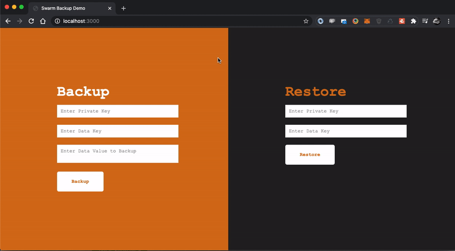

 

# Swarm Backup

<hr>

A library to back up and restore encrypted data using swarm.



## Overview

### Installation

`$ npm i`

### Data Disclaimer

Swarm is in beta and as such data retention cannot be guaranteed, be sure to keep data safe and secure in a secondary location.   

### Usage

#### Instantiate the Class

**new SwarmBackup()**

Instantiate the class passing the URL of the Swarm gateway and a valid private key.  

| Param |	Type | Required | Default | Purpose |
| ----- | ---- | -------- | ------- | ------- |
| gateway | string | true |  | The URL of the Swarm Gateway |
| privateKey | string | true | | A valid Private Key |

##### Example

```
const gateway = 'http://localhost:1633';
const w1 = await new Wallet().generate('test-pw-1');
const privateKey = w1.wallet.privateKey;

const sb = new SwarmBackup(gateway, privateKey);
```

#### Backup Data

**backup()**

Pass the data key as a string and the value of the data you want to backup.  

| Param |	Type | Required | Default | Purpose |
| ----- | ---- | -------- | ------- | ------- |
| key | string | true | | A string to identify your data |
| data | any | true | | The data to backup |
 
##### Example

```
const key = 'name';
const value = 'John';
const backup = sb.backup(key, value); //returns private key on success
```

#### Restore Data

**restore()**

Pass the data key as a string and it returns the latest data available for this key and private key.  

| Param |	Type | Required | Default | Purpose |
| ----- | ---- | -------- | ------- | ------- |
| key | string | true |  | A string to identify your data |

##### Example

```
const key = 'name';
const backup = sb.restore(key); //returns "John"
```

### Use in a Web Browser

To use this library in the web browser use webpack to create a bundle.

```
npm run pack
```
The bundle will be generated and stored in dist/web/bundle.js

Include the library as normal and instantiate the class using the same example as above.  

### License

Swarm Backup is released under the MIT License.